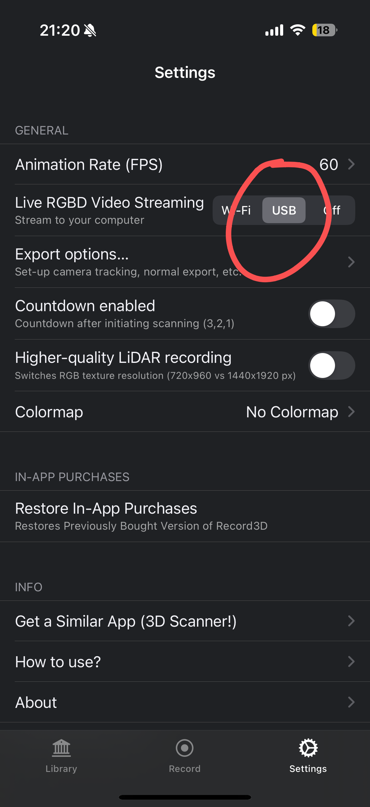

# Step1: Using iPhone as a robot camera
Hardware Prerequisites: iPhone that has a lidar (e.g. iPhone15 pro), a ubuntu machine, USB 3.0 cable.


## On your iPhone
- Download [Record3D app](https://apps.apple.com/us/app/record3d-3d-videos/id1477716895?ls=1) on your iPhone, which allows you (among other features) to  live-stream RGB**D** video from iOS devices with TrueDepth camera to a computer.

- Connect your iPhone to your computer using a USB 3.0 cable.

- In the Record3D app, select USB mode in the settings (a one-time fee of $5 is required). Press the record button to start streaming RGBD data. Once you press the record button, make sure the app remains in the foreground. If it stops working, try restarting the app.



## On your Computer
To stream RGB-D:
<div class="highlight highlight-source-shell notranslate position-relative overflow-auto" dir="auto" data-snippet-clipboard-copy-content="conda activate via
cd async_iphone_vr
python record3d_iPhone_rgbd_streaming.py">
<pre><code>conda activate via
cd async_iphone_vr
python record3d_iPhone_rgbd_streaming.py</code></pre>
</div>


To stream point cloud in the world frame:
<div class="highlight highlight-source-shell notranslate position-relative overflow-auto" dir="auto" data-snippet-clipboard-copy-content="conda activate via
cd async_iphone_vr
python iPhone_world_frame_pointcloud_streaming.py">
<pre><code>conda activate via
cd async_iphone_vr
python iPhone_world_frame_pointcloud_streaming.py</code></pre>
</div>


# Step2: Using VisionPro for VR rendering

## Setup VisionPro

We recommend setting up a Local Area Network (LAN) using a router. Connect the computer to the router via an Ethernet cable, and connect the Vision Pro to the same LAN over Wi-Fi.

Hardware Prerequisites: VisionPro, a router, an Ethernet cable.

(Why VisionPro? Meta quest 3 compute does not support online rendering, which is why VisionPro is significantly more expensive—due to its powerful computing capabilities.)


<li>install mkcert: <a href="https://github.com/FiloSottile/mkcert">https://github.com/FiloSottile/mkcert</a></li>
<li>check local ip address:</li>
</ol>
<div class="snippet-clipboard-content notranslate position-relative overflow-auto" data-snippet-clipboard-copy-content="    ifconfig | grep inet"><pre class="notranslate"><code>    ifconfig | grep inet
</code></pre></div>
<p dir="auto">Suppose the local ip address of the ubuntu machine is <code>192.168.8.102</code>.</p>

<li>create certificate:</li>
</ol>
<div class="snippet-clipboard-content notranslate position-relative overflow-auto" data-snippet-clipboard-copy-content="    mkcert -install &amp;&amp; mkcert -cert-file cert.pem -key-file key.pem 192.168.8.102 localhost 127.0.0.1"><pre class="notranslate"><code>    mkcert -install &amp;&amp; mkcert -cert-file cert.pem -key-file key.pem 192.168.8.102 localhost 127.0.0.1
</code></pre></div>
<p dir="auto">ps. place the generated <code>cert.pem</code> and <code>key.pem</code> files in <code>Vision-in-Action/src</code> and <code>Vision-in-Action/async_point_cloud_render</code>..</p>

<li>open firewall on server</li>
</ol>
<div class="snippet-clipboard-content notranslate position-relative overflow-auto" data-snippet-clipboard-copy-content="    sudo iptables -A INPUT -p tcp --dport 8012 -j ACCEPT
    sudo iptables-save
    sudo iptables -L"><pre class="notranslate"><code>    sudo iptables -A INPUT -p tcp --dport 8012 -j ACCEPT
    sudo iptables-save
    sudo iptables -L
</code></pre></div>
<p dir="auto">or can be done with <code>ufw</code>:</p>
<div class="snippet-clipboard-content notranslate position-relative overflow-auto" data-snippet-clipboard-copy-content="    sudo ufw allow 8012"><pre class="notranslate"><code>    sudo ufw allow 8012
</code></pre></div>


<li>install ca-certificates on VisionPro</li>
</ol>
<div class="snippet-clipboard-content notranslate position-relative overflow-auto" data-snippet-clipboard-copy-content="    mkcert -CAROOT"><pre class="notranslate"><code>    mkcert -CAROOT
</code></pre></div>
<p dir="auto">Copy the rootCA.pem via AirDrop to VisionPro and install it.</p>
<p dir="auto">Settings &gt; General &gt; About &gt; Certificate Trust Settings. Under "Enable full trust for root certificates", turn on trust for the certificate.</p>
<p dir="auto">Settings &gt; Apps &gt; Safari &gt; Advanced &gt; Feature Flags &gt; Enable WebXR Related Features</p>


## Point Cloud Rendering

### On your iPhone
Press the record button to start streaming RGBD data. Once you press the record button, make sure the app remains in the foreground. If it stops working, try restarting the app.

### On your Computer


Open a terminal:

``` sh
cd async_point_cloud_render/
./roscore.sh 
```

Open a new terminal:
``` sh
cd async_point_cloud_render/
./iphone.sh 
```

Open a new terminal:
``` sh
cd async_point_cloud_render/
./visionpro.sh 
```


<p dir="auto">open the browser on Safari on VisionPro and go to <code>https://192.168.8.102:8012?ws=wss://192.168.8.102:8012</code></p>
<p dir="auto">Click <code>Enter VR</code> and <code>Allow</code> to start the VR session.</p>
</ol>


You can now freely move your iPhone to actively change its viewpoint, or move your head to render the scene from different poses.
