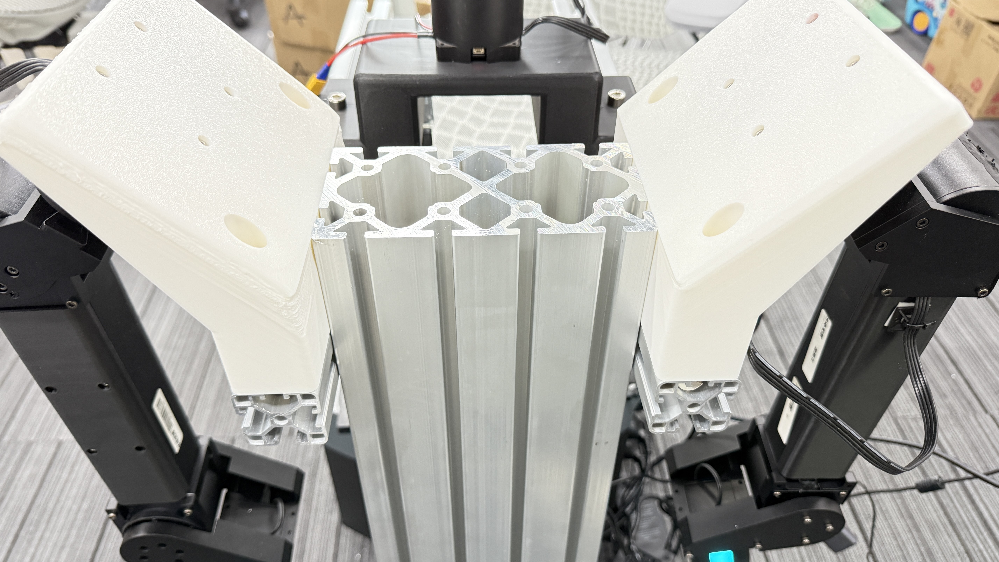

# ViA Hardware Guide

To study active perception, we build a minimal humanoid,
</br>
using three off-the-shelf ARX arms, several 4040 frames from Amazon, and a few 3D-printed connecting parts.


## Assemble


Please refer to the following 
[BOM](./BOM.md), and [3D printing guide](./3D_Printing/),
</br>
to assemble the robots (we provide a tabletop option and a mobile manipulation option).

<div style="display: flex; gap: 10px; align-items: center;">
  
  
</div>


We also provide a [CAD model](https://cad.onshape.com/documents/f26cb6f25e3d003b1ab56544/w/206a9a47e71c9aca35c72a44/e/74605670bc24bf806b5e0395) for the whole hardware design.


## Multi-arm CAN Setup
After completing the robot assembly, please follow the guide below to set up the CAN communication:

### Step 1: Test the CAN-USB connection
We recommend using this [CAN adapter](https://www.amazon.com/DSD-TECH-Adapter-Hardware-Canable/dp/B0BQ5G3KLR/ref=asc_df_B0BQ5G3KLR?mcid=4fd05eea7a413a2dbe7ebca1e51c5f33&hvocijid=8032424359625485838-B0BQ5G3KLR-&hvexpln=73&tag=hyprod-20&linkCode=df0&hvadid=721245378154&hvpos=&hvnetw=g&hvrand=8032424359625485838&hvpone=&hvptwo=&hvqmt=&hvdev=c&hvdvcmdl=&hvlocint=&hvlocphy=1014226&hvtargid=pla-2281435178618&psc=1).


``` sh
sudo apt install can-utils
sudo apt install net-tools
```

<p dir="auto">Plug in the CAN device and run the following command to check the available CAN devices.</p>
<div class="highlight highlight-source-shell notranslate position-relative overflow-auto" dir="auto" data-snippet-clipboard-copy-content="ls -l /sys/class/net/can*"><pre>ls -l /sys/class/net/can<span class="pl-k">*</span></pre></div>
<p dir="auto">This should give you something like this</p>

<div class="highlight highlight-source-shell notranslate position-relative overflow-auto" dir="auto" data-snippet-clipboard-copy-content="lrwxrwxrwx 1 root root 0 Jul 15 14:35 /sys/class/net/can0 -&gt; ../../devices/platform/soc/your_can_device/can0
lrwxrwxrwx 1 root root 0 Jul 15 14:35 /sys/class/net/can1 -&gt; ../../devices/platform/soc/your_can_device/can1
lrwxrwxrwx 1 root root 0 Jul 15 14:35 /sys/class/net/can2 -&gt; ../../devices/platform/soc/your_can_device/can2">
<pre><code>lrwxrwxrwx 1 root root 0 Jul 15 14:35 /sys/class/net/can0 -&gt; ../../devices/platform/soc/your_can_device/can0
lrwxrwxrwx 1 root root 0 Jul 15 14:35 /sys/class/net/can1 -&gt; ../../devices/platform/soc/your_can_device/can1
lrwxrwxrwx 1 root root 0 Jul 15 14:35 /sys/class/net/can2 -&gt; ../../devices/platform/soc/your_can_device/can2
</code></pre>
</div>


<p dir="auto">Where can0, can1, can2 are the CAN devices names.</p>
<p dir="auto">You need to bring up the CAN interface with</p>


<div class="highlight highlight-source-shell notranslate position-relative overflow-auto" dir="auto" data-snippet-clipboard-copy-content="sudo ip link set can0 up type can bitrate 1000000
sudo ip link set can1 up type can bitrate 1000000
sudo ip link set can2 up type can bitrate 1000000">
<pre><code>sudo ip link <span class="pl-c1">set</span> can0 up <span class="pl-c1">type</span> can bitrate 1000000
sudo ip link <span class="pl-c1">set</span> can1 up <span class="pl-c1">type</span> can bitrate 1000000
sudo ip link <span class="pl-c1">set</span> can2 up <span class="pl-c1">type</span> can bitrate 1000000</code></pre>
</div>


### Step 2: Rename CAN devices

To get serial numbers of the CAN devices, run:

<div class="highlight highlight-source-shell notranslate position-relative overflow-auto" dir="auto" data-snippet-clipboard-copy-content="udevadm info -a -p /sys/class/net/can0 | grep -i serial
udevadm info -a -p /sys/class/net/can1 | grep -i serial
udevadm info -a -p /sys/class/net/can2 | grep -i serial">
<pre><code>udevadm info -a -p /sys/class/net/can0 <span class="pl-k">|</span> grep -i serial
udevadm info -a -p /sys/class/net/can1 <span class="pl-k">|</span> grep -i serial
udevadm info -a -p /sys/class/net/can2 <span class="pl-k">|</span> grep -i serial</code></pre>
</div>


<p dir="auto">edit <code>/etc/udev/rules.d/90-can.rules</code></p>
<div class="highlight highlight-source-shell notranslate position-relative overflow-auto" dir="auto" data-snippet-clipboard-copy-content="sudo vim /etc/udev/rules.d/90-can.rules"><pre>sudo vim /etc/udev/rules.d/90-can.rules</pre></div>

<p dir="auto">add</p>
<div class="snippet-clipboard-content notranslate position-relative overflow-auto" data-snippet-clipboard-copy-content="SUBSYSTEM==&quot;net&quot;, ACTION==&quot;add&quot;, ATTRS{serial}==&quot;004700415842500820333850&quot;, NAME=&quot;can_top&quot;
SUBSYSTEM==&quot;net&quot;, ACTION==&quot;add&quot;, ATTRS{serial}==&quot;0048001C5842500820333850&quot;, NAME=&quot;can_right&quot;
SUBSYSTEM==&quot;net&quot;, ACTION==&quot;add&quot;, ATTRS{serial}==&quot;004600295842500820333850&quot;, NAME=&quot;can_left&quot;
"><pre class="notranslate"><code>
SUBSYSTEM=="net", ACTION=="add", ATTRS{serial}=="004700415842500820333850", NAME="can_top"
SUBSYSTEM=="net", ACTION=="add", ATTRS{serial}=="0048001C5842500820333850", NAME="can_right"
SUBSYSTEM=="net", ACTION=="add", ATTRS{serial}=="004600295842500820333850", NAME="can_left"
</code></pre>
</div>

Replace the serial numbers and ensure you clearly identify which arm corresponds to the top, right, and left positions.
<p dir="auto"><strong>Important:</strong> The name should start with <code>can</code> (for USB-CAN adapters) or <code>en</code>/<code>eth</code> (for EtherCAT-CAN adapters). The maximum length for a CAN interface name is 13 characters.</p>


### Step 3: Reload udev Rules


<div class="highlight highlight-source-shell notranslate position-relative overflow-auto" dir="auto" data-snippet-clipboard-copy-content="sudo udevadm control --reload-rules &amp;&amp; sudo systemctl restart systemd-udevd &amp;&amp; sudo udevadm trigger"><pre>sudo udevadm control --reload-rules <span class="pl-k">&amp;&amp;</span> sudo systemctl restart systemd-udevd <span class="pl-k">&amp;&amp;</span> sudo udevadm trigger</pre></div>
<p dir="auto">Unplug and replug the CAN device to ensure the changes take effect.</p>
<p dir="auto">Run the following command to set up the CAN device, and you need to run this command after every reboot.</p>
<div class="snippet-clipboard-content notranslate position-relative overflow-auto" data-snippet-clipboard-copy-content="sudo ip link set up can_top type can bitrate 1000000
sudo ip link set up can_right type can bitrate 1000000
sudo ip link set up can_left type can bitrate 1000000
"><pre class="notranslate"><code>sudo ip link set up can_top type can bitrate 1000000
sudo ip link set up can_right type can bitrate 1000000
sudo ip link set up can_left type can bitrate 1000000
</code></pre></div>


### Step 4: Run the robot initalization


Open a new terminal and run <code>roscore</code>.

Open another terminal and run:
<div class="highlight highlight-source-shell notranslate position-relative overflow-auto" dir="auto" data-snippet-clipboard-copy-content="cd Vision-in-Action/src
python robot_controller_node.py">
<pre><code>cd Vision-in-Action/src
python robot_controller_node.py</code></pre>
</div>

You should see the robot start running.


